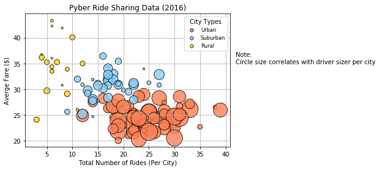
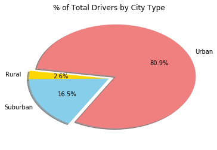
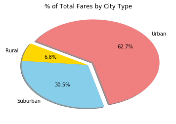
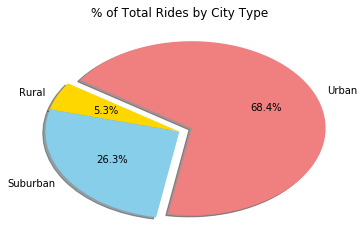

# Final Analysis

## Observable trends based on data

### Supply-Demand:

* We can observe that as the "total number of rides" per city type increases, so does the "average price" per ride increase; "price" then, adjustes at the point where the quantity demanded (number of rides) equal the quantity supplied(total drivers available).

### Demographics:

* We can observe that the "Percentage of Total Drivers"(80.9%) is positively correlated with the "Percentage of Total Rides"(68.4%) and "Percentage of Total Fares"(62.7%); the more total drivers available the more total rides occurring and thus the more amount of total fares received.
 
* "Rural" average fares are highest, then "Suburban", last "Urban", which are inversely correlated with the "Percentage of Total Drivers" available (2.6%), (16.5%), (80.9%), respectively.

-----

* What good is data without a good plot to tell the story? -[Requirements](https://github.com/mjvillacresesn/Ride-Share/blob/master/Pyber/README.md)
* Jupyter Notebook - [ Code ](https://github.com/mjvillacresesn/Ride-Share/blob/master/Pyber/pyber_starter.ipynb)

